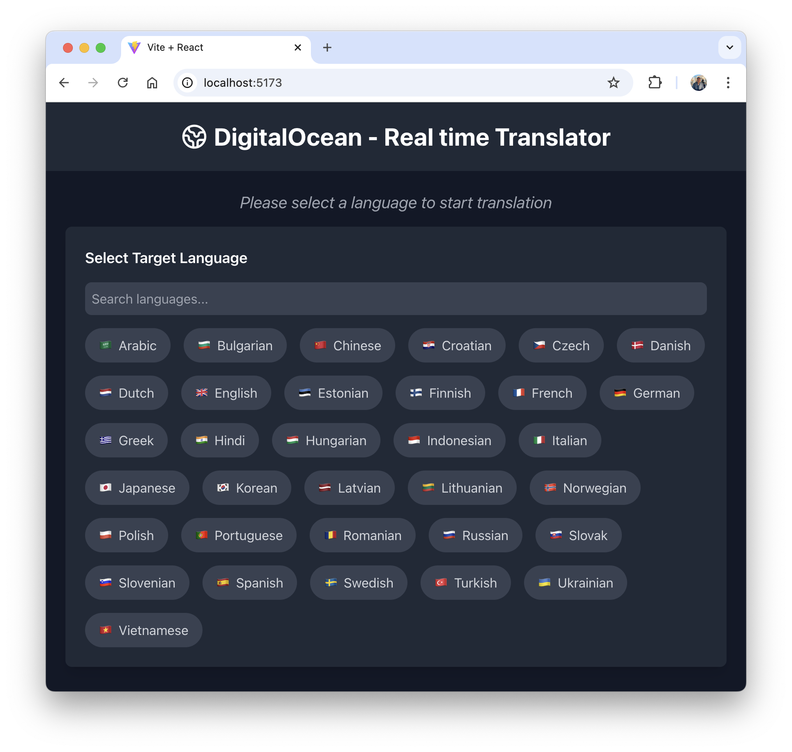

# Real-time Speech Translation Web Interface

This guide provides steps for setting up a real-time speech translation web interface that combines Automatic Speech Recognition (ASR) and Neural Machine Translation (NMT) services to provide instant translations in multiple languages.



## Prerequisites

Before setting up this project, you need to have:

1. **ASR Server**: Follow the setup instructions in [ai-ml-bootstrapper/automatic-speech-recognition](https://github.com/hivenetes/ai-ml-bootstrapper/tree/main/automatic-speech-recognition)
2. **Language Translator Server**: Follow the setup instructions in [ai-ml-bootstrapper/language-translator](https://github.com/hivenetes/ai-ml-bootstrapper/tree/main/language-translator)
3. **Client Dependencies**:
   - Python 3.8+
   - Node.js 16+
   - npm 8+

## Project Setup

1. **Install Python Dependencies**:

   ```bash
   pip3 install nvidia-riva-client PyAudio
   ```

2. **Install Web App Dependencies**:

   ```bash
   cd web
   npm install
   ```

## Project Structure

```
real-time-translator/
├── translations/          # Directory for translation JSON files
├── web/                  # React web application
│   ├── src/
│   │   ├── components/
│   │   └── ...
├── speech_translator.py  # Multi-language translation script
└── README.md
```

## Running the Application

1. **Start the Translation Script**:

   Run the speech translator with your desired target languages. Replace `<asr-ip>` and `<nmt-ip>` with your server IPs:

   ```bash
   python3 speech_translator.py \
     --asr-server <asr-ip>:50051 \
     --nmt-server <nmt-ip>:50052 \
     --input-device 2 \
     --source-lang en-US \
     --target-langs ar,bg,zh,hr,cs,da,nl,en,et,fi,fr,de,el,hi,hu,id,it,ja,ko,lv,lt,no,pl,pt,ro,ru,sk,sl,es,sv,tr,uk,vi \
     --output-dir translations
   Starting concurrent multi-language speech translation from en-US
   Target languages: ar, bg, zh, hr, cs, da, nl, en, et, fi, fr, de, el, hi, hu, id, it, ja, ko, lv, lt, no, pl, pt, ro, ru, sk, sl, es, sv, tr, uk, vi
   Writing translations to: translations
   Speak into your microphone. Press Ctrl+C to stop.
   --------------------------------------------------
   
   [zh] Original: Hello, Testing. Testing. 
   [zh] Translated: 您好,测试。测试
   
   [nl] Original: Hello, Testing. Testing. 
   [nl] Translated: Hallo, Ik ben een nieuwsgierige persoon.
   
   [el] Original: Hello, Testing. Testing. 
   [el] Translated: Γεια σας, Δοκιμασία. Δοκιμασία.
   
   [hr] Original: Hello, Testing. Testing. 
   [hr] Translated: Pozdravljeni, Testiranje. Testiranje.
   
   [hu] Original: Hello, Testing. Testing. 
   [hu] Translated: Üdvözlöm, tesztelés. Tesztelés.
   
   [ro] Original: Hello, Testing. Testing. 
   [ro] Translated: Buna ziua, testare.
   
   [et] Original: Hello, Testing. Testing. 
   [et] Translated: Tere, testimine. Testimine.
   
   [sl] Original: Hello, Testing. Testing. 
   [sl] Translated: Pozdravljeni, testiranje. Testiranje.
   
   [no] Original: Hello, Testing. Testing. 
   [no] Translated: Hei, Testing. Test.
   
   [ru] Original: Hello, Testing. Testing. 
   [ru] Translated: Здравствуйте, Тестирование. Тестирование.
   
   [it] Original: Hello, Testing. Testing. 
   [it] Translated: Ciao, test. Test.
   
   [sk] Original: Hello, Testing. Testing. 
   [sk] Translated: Dobrý deň, testovanie.
   
   [es] Original: Hello, Testing. Testing. 
   [es] Translated: Hola, Pruebas. Pruebas.
   
   [pt] Original: Hello, Testing. Testing. 
   [pt] Translated: Olá, testando. Testando
   
   [sv] Original: Hello, Testing. Testing. 
   [sv] Translated: Hej, tester. Testar.
   
   [ko] Original: Hello, Testing. Testing. 
   [ko] Translated: 안녕하세요 테스트입니다 테스팅입니다
   
   [pl] Original: Hello, Testing. Testing. 
   
   [lt] Original: Hello, Testing. Testing. 
   [lt] Translated: Sveiki, bandymai. Bandymai
   
   [de] Original: Hello, Testing. Testing. 
   [de] Translated: Hallo, ich bin ein Testing.
   
   [en] Original: Hello, Testing. Testing. 
   [pl] Translated: Witam, testowanie. Testowanie
   [en] Translated: Hello, Testing. Test.
   
   [vi] Original: Hello, Testing. Testing. 
   [vi] Translated: Chào bạn, Testing. Test.
   
   [da] Original: Hello, Testing. Testing. 
   [da] Translated: Hej, Testning. Testing.
   
   [uk] Original: Hello, Testing. Testing. 
   [uk] Translated: Привіт, тестування. Тестування.
   
   [lv] Original: Hello, Testing. Testing. 
   [lv] Translated: Labdien, testēšana. Testēšana
   
   [cs] Original: Hello, Testing. Testing. 
   [cs] Translated: Dobrý den, testování.
   
   [fr] Original: Hello, Testing. Testing. 
   [fr] Translated: Bonjour, Testing. Test.
   
   [ar] Original: Hello, Testing. Testing. 
   
   [tr] Original: Hello, Testing. Testing. 
   [tr] Translated: Merhaba, Test. Test etme.
   [ar] Translated: مرحبا، اختبار. اختبار.
   
   [hi] Original: Hello, Testing. Testing. 
   [hi] Translated: नमस्कार, परीक्षण। परीक्षण करना।
   
   [id] Original: Hello, Testing. Testing. 
   [id] Translated: Halo, Pengujian. Pengujian.
   
   [bg] Original: Hello, Testing. Testing. 
   [bg] Translated: Здравейте, Тестване. Тестиране.
   
   [fi] Original: Hello, Testing. Testing. 
   [fi] Translated: Hei, testaus. Testaus.
   
   [ja] Original: Hello, Testing. Testing. 
   [ja] Translated: こんにちは、テスト。テスト
   ^C
   Stopping speech translation...
   ```

   To list available audio input devices:
   ```bash
   python3 speech_translator.py --list-devices
   ```

2. **Start the Web Interface**:

   ```bash
   cd web
   npm run dev
   ```

   The web interface will be available at `http://localhost:5173`

## Supported Languages

The system supports translation between the following languages:

| Language    | Code | Language    | Code |
|-------------|------|-------------|------|
| Arabic      | ar   | Japanese    | ja   |
| Bulgarian   | bg   | Korean      | ko   |
| Czech       | cs   | Lithuanian  | lt   |
| Danish      | da   | Latvian     | lv   |
| German      | de   | Dutch       | nl   |
| Greek       | el   | Norwegian   | no   |
| English     | en   | Polish      | pl   |
| Spanish     | es   | Portuguese  | pt   |
| Estonian    | et   | Romanian    | ro   |
| Finnish     | fi   | Russian     | ru   |
| French      | fr   | Slovak      | sk   |
| Hindi       | hi   | Slovenian   | sl   |
| Croatian    | hr   | Swedish     | sv   |
| Hungarian   | hu   | Turkish     | tr   |
| Indonesian  | id   | Ukrainian   | uk   |
| Italian     | it   | Vietnamese  | vi   |
| Chinese     | zh   |             |      |

## Features

- Real-time speech recognition
- Concurrent translation to multiple languages
- Modern web interface with dark mode
- Language search functionality
- Responsive design for mobile and desktop
- Full-screen translation display
- Easy language switching

## Technical Details

The application consists of two main components:

1. **Speech Translator Script (`speech_translator.py`)**:
   - Captures audio input using PyAudio
   - Streams audio to ASR service
   - Concurrently translates text to multiple languages
   - Writes translations to JSON files

2. **Web Interface (`web/`)**:
   - React-based frontend
   - Real-time updates using file polling
   - Tailwind CSS for styling
   - Responsive design
   - Language selection interface

## Troubleshooting

1. **Audio Device Issues**:
   - List available devices using `python3 list-input-devices.py`
   - Ensure microphone permissions are granted
   - Try different input devices if audio capture fails

2. **Translation Delays**:
   - Check network connectivity to ASR and NMT servers
   - Ensure both servers are running and accessible
   - Verify the correct ports are open

## Additional Resources

- [NVIDIA NGC Parakeet Documentation](https://build.nvidia.com/nvidia/parakeet-ctc-1_1b-asr/docker)
- [NVIDIA NGC MEGATRON-1B-NMT Documentation](https://build.nvidia.com/nvidia/megatron-1b-nmt/docker)
- [Original ASR Setup Guide](https://github.com/hivenetes/ai-ml-bootstrapper/tree/main/automatic-speech-recognition)
- [Original Language Translator Setup Guide](https://github.com/hivenetes/ai-ml-bootstrapper/tree/main/language-translator)