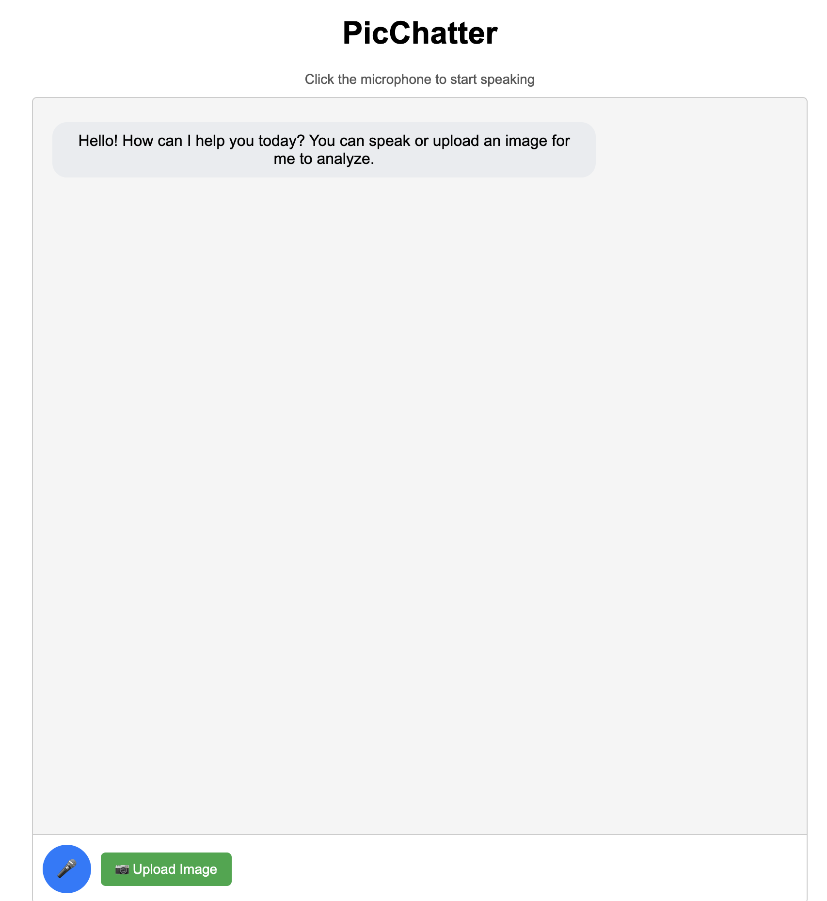

# PicChatter

A web application for image-based conversations and interactions. This application provides a simple interface for uploading images and chat about it.

## Features

- Image upload functionality
- Speak to ask question
- Pause audio  

## Screenshot


## Prerequisites

- Node.js (v12 or higher)
- npm (Node Package Manager)

## Installation

1. Clone the repository:
```bash
git clone https://github.com/yourusername/PicChatter.git
cd PicChatter
```

2. Install dependencies:
```bash
npm install
```

3. Create a `.env` file in the root directory and add your configuration:
- API_ENDPOINT is the backend application URL
- Create a Spaces bucket in DigitalOcean which will be used for uploading the images 

```env
API_ENDPOINT=<your-endpoint>

SPACES_KEY=<your-key>
SPACES_SECRET=<your-secret>
SPACES_REGION=<your-region>
SPACES_BUCKET=<your-bucket>
SPACES_ENDPOINT=<your-endpoint>
```

## Usage

To start the server:

```bash
npm start
```

The application will be available at `http://localhost:3000`.

## Project Structure

- `/views` - EJS template files
- `/uploads` - Directory for uploaded files
- `server.js` - Main application server
- `.env` - Environment configuration

## Dependencies

- express - Web application framework
- ejs - Templating engine
- dotenv - Environment variable management
- multer - File upload handling

## License

ISC

## Contributing

Feel free to submit issues and pull requests to improve the application.
